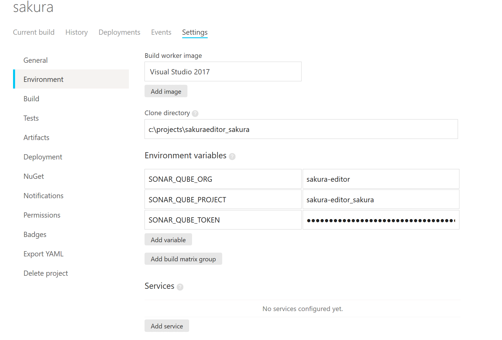

# SonarQube

## SonarCube のアカウント設定

https://sonarcloud.io/sessions/new にアクセスして GitHub アカウントでログインします。

## プロジェクトの作成

https://sonarcloud.io/projects/create にアクセスしてプロジェクトを作成します。

- Organization 名をメモしておきます。
- Project 名をメモしておきます。
- Access Token をメモしておきます。 
**この情報はパスワードと同じ意味を持つので漏れないように注意します。**

## Appveyor の設定

Appveyor のプロジェクトで Settings の Environment にアクセスして `Add variable` を押して環境変数を追加します。

|変数名|意味|注意|
|--|--|--|
|SONAR_QUBE_ORG|Sonar Qube のOrganization 識別子||
|SONAR_QUBE_PROJECT|Sonar Qube のプロジェクト識別子||
|SONAR_QUBE_TOKEN|Sonar Qube のアクセスキー (API キー)|追加するとき右の鍵マークを押して秘密の環境変数に設定します|



## SonarQube の使用方法

### 準備

1. https://chocolatey.org/install#install-with-cmdexe を参考に chocolatey をインストールする。(appveyor 上では不要)
2. `choco install "msbuild-sonarqube-runner" -y` を使用して必要なファイルをインストールする。
3. https://sonarcloud.io/static/cpp/build-wrapper-win-x86.zip をダウンロードする。
4. build-wrapper-win-x86.zip を解凍する。

### 解析手順

1. `C:\ProgramData\chocolatey\bin\SonarScanner.MSBuild.exe begin` を呼ぶ。
2. build-wrapper-win-x86-64.exe を使って msbuild.exe を起動する。
3. `C:\ProgramData\chocolatey\bin\SonarScanner.MSBuild.exe end` を呼ぶ。

## SonarQube をローカルでビルドする方法

SONAR_QUBE_TOKEN の値は SonarQube のサイトでログインして確認できます。

```
set SONAR_QUBE=Yes
set SONAR_QUBE_ORG=sakura-editor
set SONAR_QUBE_PROJECT=sakura-editor_sakura
set SONAR_QUBE_TOKEN=xxxxxxxxxxxxxxxxxxxxxxxxxxxxxx
build-sln.bat Win32 Release
```

## SonarQube に関する情報

### SonarQube の使用方法に関するサイト

- https://www.appveyor.com/blog/2016/12/23/sonarqube/
- https://docs.sonarqube.org/7.4/analysis/analysis-parameters/

### chocolatey のインストール方法 (SonarQube 関連のファイルのインストールに使用)

https://chocolatey.org/install#install-with-cmdexe

### Secure the GitHub Authentication token

SonarQube で使用するアクセストークンを暗号化するために使用する

https://www.appveyor.com/docs/build-configuration/#secure-variables

### SonarScanner の使用方法

https://docs.sonarqube.org/display/SCAN/Analyzing+with+SonarQube+Scanner+for+MSBuild#AnalyzingwithSonarQubeScannerforMSBuild-Usage
