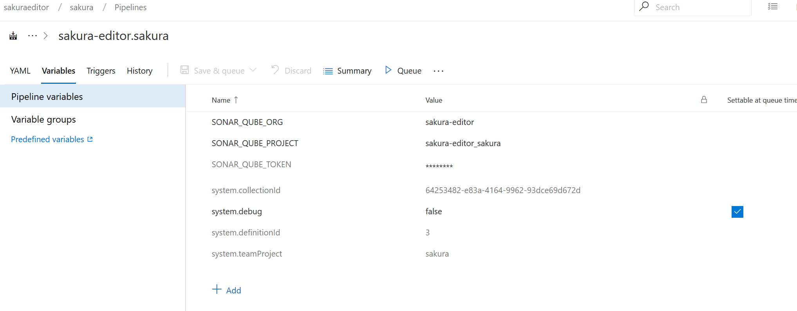
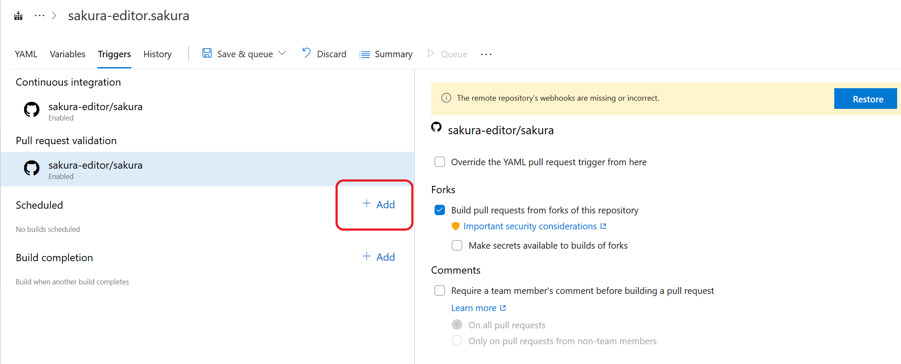
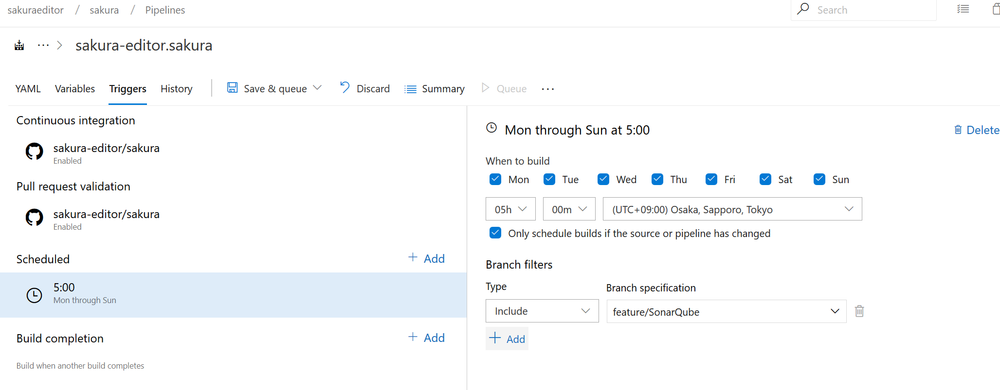
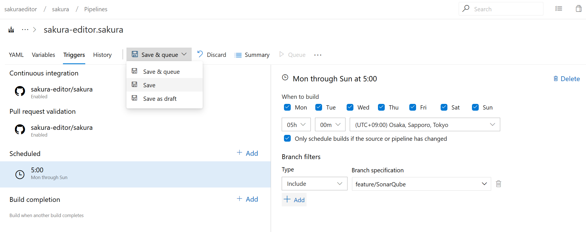

# SonarQube

## SonarQube のローカルでの使用方法

### SonarQube のアカウント設定

https://sonarcloud.io/sessions/new にアクセスして GitHub アカウントでログインします。

### プロジェクトの作成

https://sonarcloud.io/projects/create にアクセスしてプロジェクトを作成します。

- Organization 名をメモしておきます。
- Project 名をメモしておきます。
- Access Token をメモしておきます。 
**この情報はパスワードと同じ意味を持つので漏れないように注意します。**

### 環境設定

1. https://www.java.com/ja/download/ から JAVA のランタイムをダウンロードしてインストールする
2. `JAVA_HOME` の環境変数を設定する

	例

	`set JAVA_HOME=C:\Program Files (x86)\Java\jre1.8.0_201`

3. https://chocolatey.org/install#install-with-cmdexe を参考に chocolatey をインストールする。
4. `choco install "msbuild-sonarqube-runner" -y` を使用して必要なファイルをインストールする。
5. https://sonarcloud.io/static/cpp/build-wrapper-win-x86.zip をダウンロードする。
6. build-wrapper-win-x86.zip を解凍する。

### 解析手順の流れ (一般論)

1. 必要なファイルをダウンロード、インストールする。
2. `C:\ProgramData\chocolatey\bin\SonarScanner.MSBuild.exe begin` を呼ぶ。
3. `build-wrapper-win-x86.zip` の中の `build-wrapper-win-x86-64.exe` を使って msbuild.exe を起動する。
4. `C:\ProgramData\chocolatey\bin\SonarScanner.MSBuild.exe end` を呼ぶ。

## サクラエディタを SonarQube でビルドする手順

`SONAR_QUBE_TOKEN` の値は SonarQube のサイトにログインして確認できます。

`SONAR_QUBE_ORG` と  `SONAR_QUBE_PROJECT` と `SONAR_QUBE_TOKEN` の値はそれぞれ自分が作成したものに読み替えてください。

```
set SONAR_QUBE=Yes
set SONAR_QUBE_ORG=sakura-editor
set SONAR_QUBE_PROJECT=sakura-editor_sakura
set SONAR_QUBE_TOKEN=xxxxxxxxxxxxxxxxxxxxxxxxxxxxxx
build-sln.bat Win32 Release
```

## SonarQube に関する情報

### SonarQube の使用方法に関するサイト

- https://www.appveyor.com/blog/2016/12/23/sonarqube/
- https://docs.sonarqube.org/7.4/analysis/analysis-parameters/

### SonarScanner の使用方法

https://docs.sonarqube.org/display/SCAN/Analyzing+with+SonarQube+Scanner+for+MSBuild#AnalyzingwithSonarQubeScannerforMSBuild-Usage

## CI でのビルド

### azure pipelines の設定

#### 環境変数

1. https://dev.azure.com/sakuraeditor/sakura にアクセスします。
2. `Pipelines` を選ぶ
3. `Edit` ボタンを押す
4. `Run` の右隣りのアイコンをクリックする
5. `Variables` のボタンを押す
6. `Pipelines Variables` で `Add` を押す
7. `SONAR_QUBE_ORG` と  `SONAR_QUBE_PROJECT` を追加してそれぞれ値を設定する
8. `SONAR_QUBE_TOKEN` を追加して値を設定し、 鍵のアイコンをクリックする (重要) 
9. `Save & Queue` で `Save` を選ぶ



#### スケジュール設定

1. https://dev.azure.com/sakuraeditor/sakura にアクセスします。
2. `Pipelines` を選ぶ
3. `Edit` ボタンを押す
4. `Run` の右隣りのアイコンをクリックする
5. `Triggers` のボタンを押す
6. `Scheduled` の `Add` をクリックする

7. 実行させたいスケジュールを設定して、実行させる対象ブランチを設定する

8. 設定を保存する


#### azure-pipelines.yml の設定

```
- job: SonarQube
  timeoutInMinutes: 120
  variables:
    SONAR_QUBE: Yes
  condition:
    eq(variables['Build.Reason'], 'Schedule')
```

1. SonarQube の実行には時間がかかるので [timeoutInMinutes](https://docs.microsoft.com/ja-jp/azure/devops/pipelines/process/phases?view=azure-devops&tabs=yaml#timeouts) の設定を行いタイムアウト時間を延ばす
2. [variables](https://docs.microsoft.com/en-us/azure/devops/pipelines/process/variables?view=azure-devops&tabs=yaml%2Cbatch) の設定で `SONAR_QUBE` の環境変数を定義して、ビルド用のバッチファイルに [SonarQube](https://www.sonarqube.org/) を有効にしたビルドであると伝える
3. [Predefined build variables](https://docs.microsoft.com/ja-jp/azure/devops/pipelines/build/variables?view=azure-devops&tabs=yaml) のうち `Build.Reason` を参照して、どういうトリガーでビルドが行われたかを yaml の中からあるいはビルド用のバッチファイル等から参照することができる。

	- `Build.Reason` を yaml の中で参照するとき `variables['Build.Reason']`
	- `Build.Reason` を バッチファイル の中で参照するとき `BUILD_REASON`

4. [conditon](https://docs.microsoft.com/ja-jp/azure/devops/pipelines/process/conditions?view=azure-devops&viewFallbackFrom=vsts&tabs=yaml) でビルドトリガーの条件を設定する。条件指定では and や or の条件を指定することができる。

`Build.Reason` としてどういう値を設定できるかは [variables](https://docs.microsoft.com/en-us/azure/devops/pipelines/process/variables?view=azure-devops&tabs=yaml%2Cbatch) の `Build.Reason` に説明がある。


例: ビルドトリガーが定期実行のとき

```
  condition:
    eq(variables['Build.Reason'], 'Schedule')
```


例: ビルドトリガーが定期実行でも PullRequest でもないとき

```
  condition:
    and
    (
      ne(variables['Build.Reason'], 'Schedule'),
      ne(variables['Build.Reason'], 'PullRequest')
    )
```

### Appveyor の設定

**appveyor で実施する場合、タイムアウトになってビルドに成功しないので現状で使用していない **

Appveyor のプロジェクトで Settings の Environment にアクセスして `Add variable` を押して環境変数を追加する。

|変数名|意味|注意|
|--|--|--|
|SONAR_QUBE_ORG|Sonar Qube のOrganization 識別子||
|SONAR_QUBE_PROJECT|Sonar Qube のプロジェクト識別子||
|SONAR_QUBE_TOKEN|Sonar Qube のアクセスキー (API キー)|追加するとき右の鍵マークを押して秘密の環境変数に設定する|


#### Secure the GitHub Authentication token

SonarQube で使用するアクセストークンを暗号化するために使用する

https://www.appveyor.com/docs/build-configuration/#secure-variables
